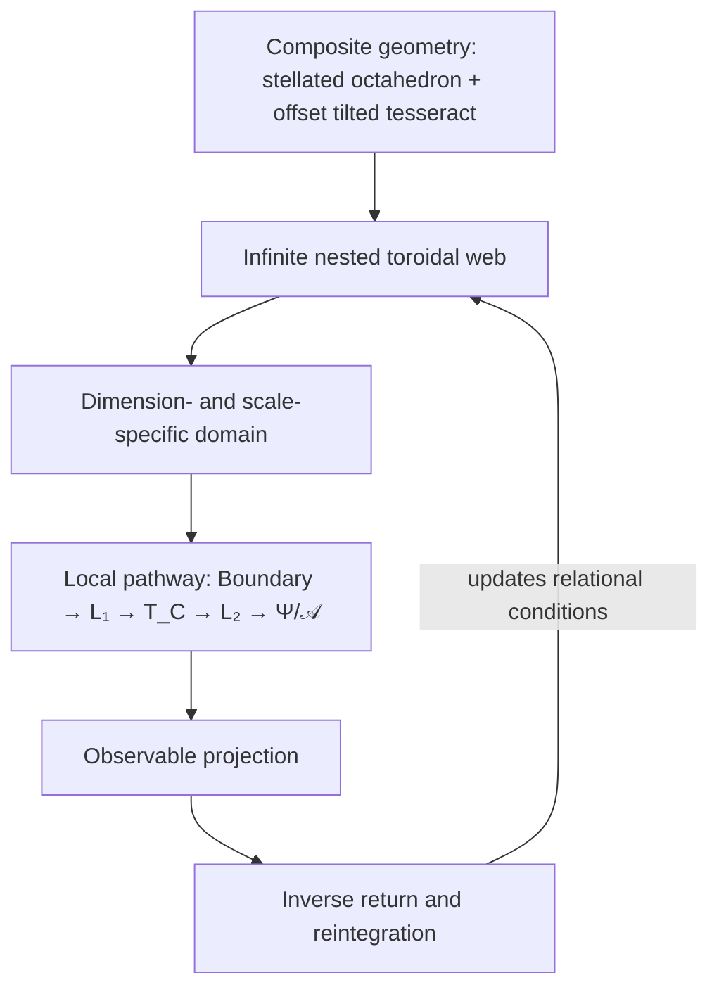

# IOM Spatial-Generative Architecture

**Status:** public architecture draft  
**Date of synthesis:** 2026-10-06  
**Role:** global spatial ontology within which the recovered processing architecture operates  
**Publication status:** published on an additive workspace branch; does not supersede `main`

## 1. Central statement

The Inside-Out Model describes the universe as an infinitely recursive, dimensionally nested toroidal web. Its toroidal domains are related across scale and dimensional depth through inverse and complementary rotations. The author's spatial understanding includes an overlapping stellated-octahedron and tilt/offset tesseract geometry underlying or interwoven with the toroidal organization. The shapes themselves are part of the asserted architecture; their exact overlap and spatial relation remain pending a drawn construction that the author can compare directly with the internally understood form. This composite geometry establishes the orientations, intersections, pathways, and transformational possibilities through which information is projected, localized, processed, returned, and recursively reorganized.

The existing information pathway

$$
\text{Higher-Dimensional Geometry}
\rightarrow
\text{Dimensional Boundary}
\rightarrow
L_1
\rightarrow
T_C
\rightarrow
L_2
\rightarrow
\Psi/\mathcal A
\rightarrow
\text{Observable Projection}
$$

is therefore a local traversal through a larger spatial system. It is not, by itself, a complete map of the universe's structure.

## 2. Foundational clarification

Inverse rotation in IOM is one invariant generative relationship expressed simultaneously across geometry, topology, dimensional nesting, information flow, recursive direction, and observation.

It appears as:

1. opposite orientation or handedness in local geometry;
2. counter-rotation between nested dimensional levels;
3. inverse or complementary winding across the two Clifford-torus cycles;
4. a return operation that complements the forward projection;
5. alternating orientation between outward projection and inward reintegration; and
6. an observational inversion produced when a higher-dimensional process is rendered within a lower-dimensional frame.

These are not six competing meanings. They are six cross-sections of the same relationship in different representational domains.

## 3. Global and local architecture

The global architecture supplies the spatial relationships. The local pathway supplies a traversable information route within them. The inverse-return relation connects local consequences back to the larger recursive structure.

## 4. Composite generative geometry

The currently preferred underlying form is not simply E8. It is the author's overlapping stellated-octahedron and offset, tilted tesseract geometry. E8 entered the history as a possible match or explanatory structure for that form; it should not replace the form merely because it offers a familiar mathematical label.

A provisional symbolic placeholder is

$$
\boxed{
\mathcal G_\star
=
\mathcal S_{\mathrm{stell}}
\bowtie_{\mathcal N}
\mathcal Q_4
}
$$

where:

- $\mathcal S_{\mathrm{stell}}$ denotes the stellated-octahedral structure;
- $\mathcal Q_4$ denotes the tesseract;
- $\mathcal N$ denotes the single perceived non-alignment described by the author as the tesseract's “tilt/offset”; it may later be decomposed mathematically into rotational and translational components if the confirmed drawing requires both; and
- $\bowtie$ denotes a specified overlap or relational composition that has not yet been mathematically fixed.

This notation is an AI formalization. The geometry, its overlap, its offset/tilt, and its preferred status are author-originated.

## 5. Recursive toroidal web

The Clifford torus $T_C$ in the processing pathway should be understood as a local relational carrier, cross-section, or implementation within a larger recursively toroidal architecture. It need not be identical to the total toroidal web.

A provisional representation of the web is

$$
\boxed{
\mathcal W
=
\left\{
T_i^{(k)},
\mathcal E_{ij}^{(k,\ell)},
\iota_k,
\pi_k,
\mathcal R_k
\right\}_{k,\ell}
}
$$

where:

- $T_i^{(k)}$ is a toroidal domain at dimensional or recursive level $k$;
- $\mathcal E_{ij}^{(k,\ell)}$ records relations between domains;
- $\iota_k$ is a nesting or embedding relation;
- $\pi_k$ is a dimensional projection; and
- $\mathcal R_k$ is the rotational orientation at that level.

The nesting is treated as bi-infinite in principle. Infinity cannot terminate in only one recursive direction without contradicting the intended architecture. A provisional index is therefore $k\in\mathbb Z$, with “inward” and “outward” defined relationally from a chosen level rather than as absolute endpoints.

## 6. The multilevel inverse relation

The multilevel inverse operation can be represented provisionally as

$$
\boxed{
\mathfrak I_k
=
\left(
\mathsf H_k,
\mathsf R_{k\leftrightarrow k+1},
\mathsf W_k,
\mathsf Q_k,
\mathsf C_k,
\mathsf O_k
\right)
}
$$

with:

| Component | Domain of expression |
|---|---|
| $\mathsf H_k$ | Handedness or orientation transformation |
| $\mathsf R_{k\leftrightarrow k+1}$ | Counter-rotation between nested levels |
| $\mathsf W_k$ | Complementary Clifford-torus winding |
| $\mathsf Q_k$ | Return complement to forward projection |
| $\mathsf C_k$ | Alternation of outward and inward recursion |
| $\mathsf O_k$ | Observational inversion under dimensional projection |

The tuple is an analytic decomposition of one operation. It should not be interpreted as evidence that the author originally proposed six independent operators. A particular recursion need not invert every component. The operator may preserve handedness while inverting winding, dimensional orientation, flow direction, or another component. Formally, a component map may be the identity in one recursion and nontrivial in another:

$$
\mathfrak I_k^{(n)}
=
\prod_{a\in A}
\mathsf I_{a,k}^{(n)},
\qquad
\mathsf I_{a,k}^{(n)}\in\{\mathrm{Id},\text{nontrivial inverse/complement}\}.
$$

This preserves the unity of the inverse relationship without forcing every manifestation to occur identically in every cycle.

### 6.1 Three simultaneous roles of $T_C$

The Clifford torus can serve all three roles identified in review:

- **carrier** when describing what it does in the local information pathway;
- **cross-section** when describing how a local dimensional view exposes part of the larger web; and
- **repeating cell** when describing how the same toroidal organization recurs across nested levels.

These are functional perspectives on the same structure, not three mutually exclusive objects.

## 7. Return is not rewind

The inverse-return phase does not undo the forward projection or simply play it backward. It transforms and reintegrates the results of localized processing. The returned state can alter the relational whole and thereby change the conditions of the next projection.

$$
\boxed{
X_k^{(n)}
\xrightarrow{\;\mathcal P_k\;}
Y_k^{(n)}
\xrightarrow{\;\mathfrak I_k\;}
X_{k\pm1}^{(n+1)}
}
$$

Here $\mathcal P_k$ is outward projection, $Y_k^{(n)}$ is a localized and processed state, and $\mathfrak I_k$ performs inverse reintegration. The result is not assumed to be the prior state. It may occur at the same, an enclosing, or a nested dimensional level.

This yields the toroidal breath relation:

$$
\boxed{
\text{Expansion}
\rightarrow
\text{Projection}
\rightarrow
\text{Localization and processing}
\rightarrow
\text{Inverse reintegration}
\rightarrow
\text{Renewed expansion}
}
$$

## 8. Traversability

The combined spatial and processing map lets a reader ask, at any point:

- Which toroidal domain or dimensional level is active?
- Is information moving in the outward-projective or inward-reintegrative phase?
- Which expression of the inverse relationship is visible?
- What is global structure, and what is a local carrier or rendering?
- What is preserved across the transition?
- What is transformed before the next recursion?

This converts IOM from a list of components and a linear processing sequence into a navigable spatial architecture.

## 9. Open definitions

The following remain explicitly unresolved:

1. the exact drawn construction of the stellated-octahedron/tesseract overlap and the author's visual confirmation of it;
2. whether the single experienced tilt/offset relation decomposes into rotation, translation, or both in a coordinate construction;
3. whether the composite form generates, constrains, or encodes the toroidal web;
4. the embedding of the Clifford torus relative to the composite geometry;
5. how winding pairs transform between nested levels;
6. the conditions selecting which inverse components act and which are preserved in a given recursion;
7. the precise map between dimensional projection and observational inversion;
8. how the universal invariant relation is instantiated by scale-dependent operators; and
9. the roles, if any, of the 24-cell and E8 after the composite geometry is explicitly constructed.

## 10. Provenance

**Author-originated core:** inside-out projection; nested toroidal web; inversely rotating thread/boundary language; dimensional nesting; toroidal breath; the Clifford-torus role; the overlapping stellated-octahedron and tilted/offset tesseract; preference for that composite form over simply naming E8; the linked meanings of inverse rotation identified in the 2026-10-06 clarification.

**AI formalization:** the terms “spatial-generative architecture” and “multilevel inverse relation”; the symbols $\mathcal G_\star$, $\mathcal W$, and $\mathfrak I_k$; the six-component tuple; the displayed transition equations; the organizational diagrams and tables.

**Interpretive status:** the claim that the previously dispersed inverse relationships are coordinated expressions of one invariant principle was explicitly affirmed by the author. Exact mathematics remains a synthesis draft.
