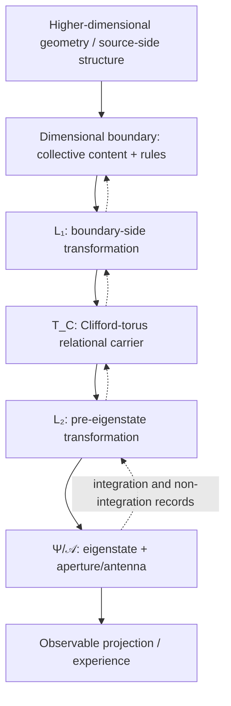
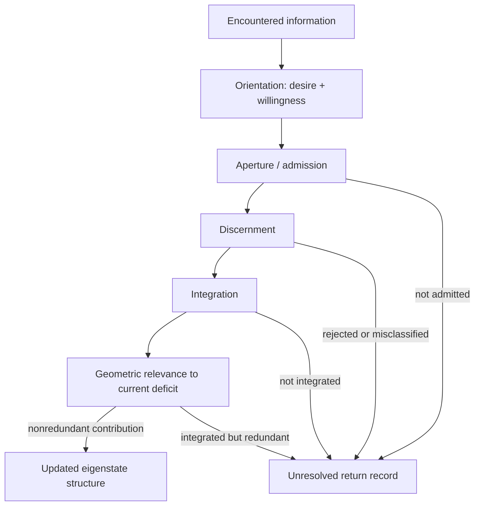
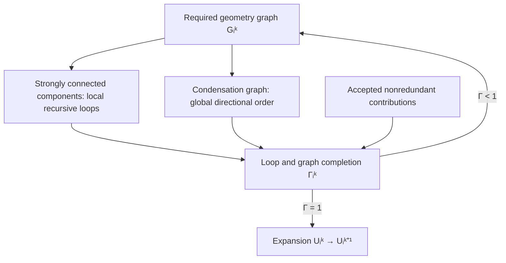
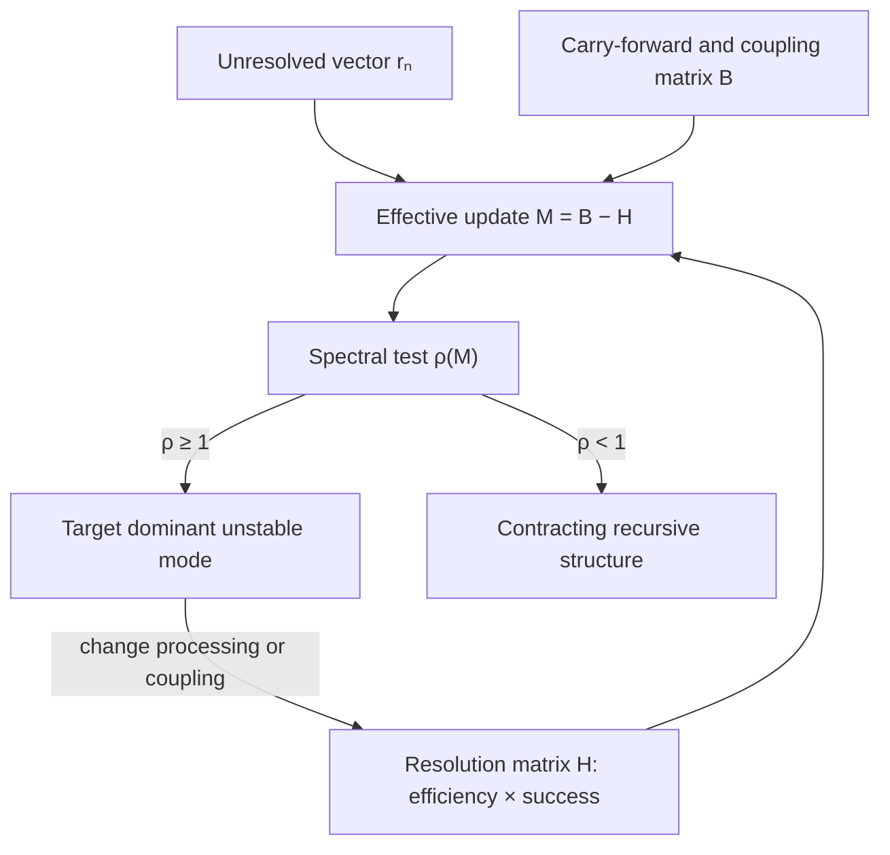
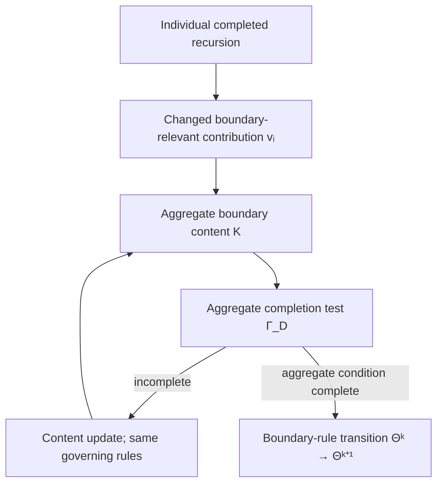
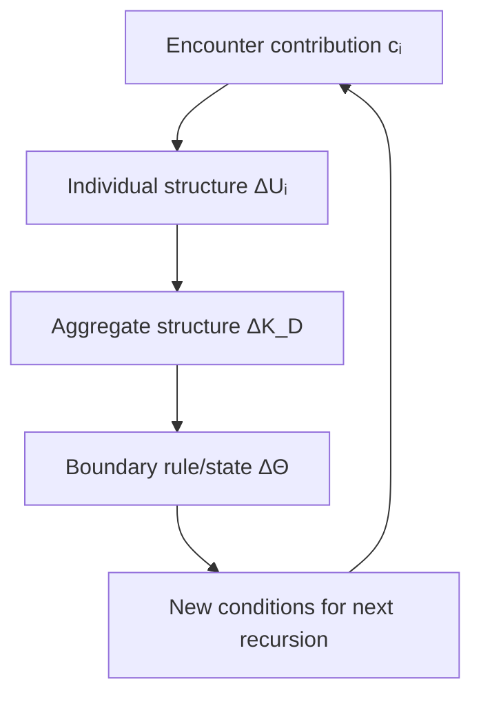
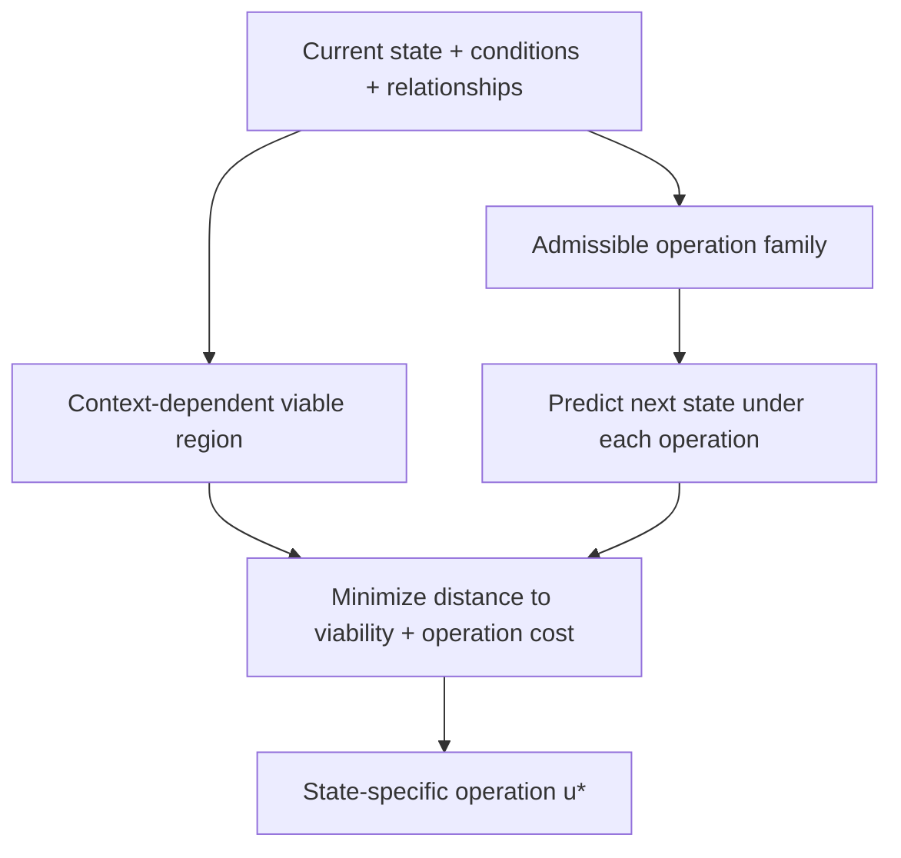
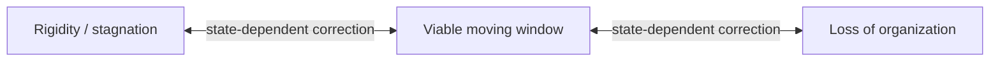
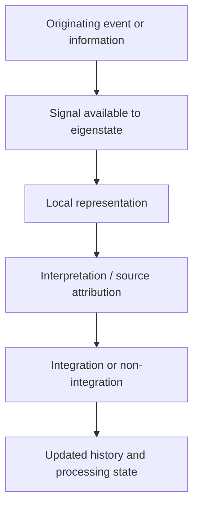
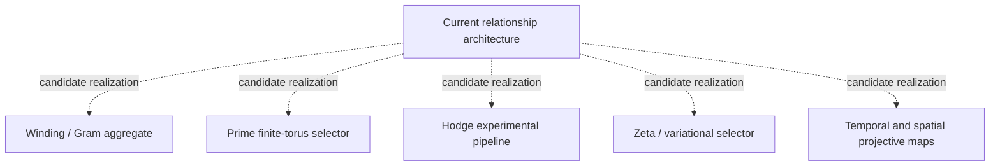

# IOM Current Recursive Relationship Maps

**Status:** representative maps for review  
**Basis:** the most current recovered recursive mechanism, with historical mathematical candidates shown separately from the accepted relationship structure

**Reading rule:** solid structural relationships represent the recovered current architecture; equations and diagnostics in the companion formalization remain proposals unless explicitly marked otherwise. Dotted candidate branches do not acquire canonical status merely by appearing on a map.

---

## Map 1 — Current architecture and return path

Solid arrows show the forward projective order. Dotted arrows show return information; they do not assert literal inverse operators.

---

## Map 2 — One local recursive encounter

This map preserves the distinction between failure to admit, failure to discern, failure to integrate, and successful integration that does not contribute to the presently missing geometry.

---

## Map 3 — Structural completion and unresolved loops

Local cycles and an overall arrow can coexist. Unresolved loops remain active; completed loops are incorporated into structure rather than erased.

---

## Map 4 — Recursive stability and entrainment

Entrainment need not copy another eigenstate or maximize every variable. It can improve a bottleneck, increase resolution efficiency, or weaken a self-reinforcing coupling aligned with the dominant unstable mode.

---

## Map 5 — Individual influence to boundary transition

An individual can change its contribution and thereby inform collective content. Boundary-rule authority remains an aggregate operation.

---

## Map 6 — Scale-recursive hierarchy

The abstract completion rule may repeat across scale, but each scale can use a different state space, deficit, and completion functional.

---

## Map 7 — Conditional inverse operation

This is the current representative meaning of inverse operation: solve backward for a conditionally viable corrective operation. It is not the reciprocal \(1/D\) of a discrepancy score and does not prescribe one ideal state for every system.

---

## Map 8 — Bounded asymmetric entropy/coherence dynamics

The viable regime is neither equality nor rest. It is a bounded nonequilibrium region in which enough coherence remains to preserve organization and enough entropy/variation remains to sustain differentiation and movement.

---

## Map 9 — Observation and representation layers

The event, available signal, constructed representation, interpretation, and integration outcome remain separate. An internally generated component and an external component may both participate in one experienced event.

---

## Map 10 — Optional mathematical realizations

These families are evaluated independently. Failure or replacement of one does not erase the accepted recursive relationships.

---

## Compact relationship ledger

| Relationship | Current treatment |
|---|---|
| `Boundary ≠ L₁ ≠ T_C ≠ L₂ ≠ Ψ/𝒜` | Preserved architectural constraint |
| Torus between two lenses | Current recovered topology |
| Aperture belongs with eigenstate | Current recovered topology |
| Integration and non-integration both return information | Current recursive mechanism |
| Integration ≠ homogenization | Current recursive mechanism |
| Successful integration ≠ expansion contribution | Current recursive mechanism |
| Geometry determines requirements; processing/history determine traversal | Current recursive mechanism |
| Recursive depth ≠ required count ≠ elapsed count | Current recursive mechanism |
| Entrainment ≠ copying | Current recursive mechanism |
| Individual influence ≠ boundary authority | Current collective constraint |
| Content update ≠ governing-rule transition | Current collective constraint |
| Dynamic balance ≠ equality or fixed equilibrium | Current discrepancy/inverse interpretation |
| Same observable output ≠ same internal mechanism | Current processing constraint |
| Winding/Gram, prime, Hodge, ζ, and temporal operators | Candidate mathematical realizations |
